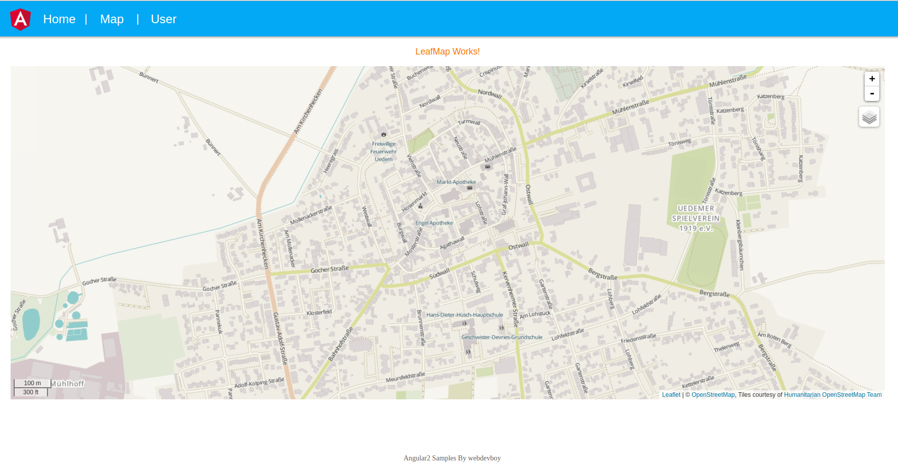

# angular2-material-leaflet-app




>Warning: Make sure you're using the latest version of Node.js and NPM

### Quick start

> Clone/Download the repo then edit `app.ts` inside [`/src/app/app.component.ts`](/src/app/app.component.ts)

```bash
# clone our repo
$ git clone https://github.com/webdevboy/angular2-materal-leaflet-app.git my-app

# change directory to your app
$ cd my-app

# install the dependencies with npm
$ npm install

# start the server
$ npm start
```
go to [http://localhost:8080](http://localhost:8080) in your browser.